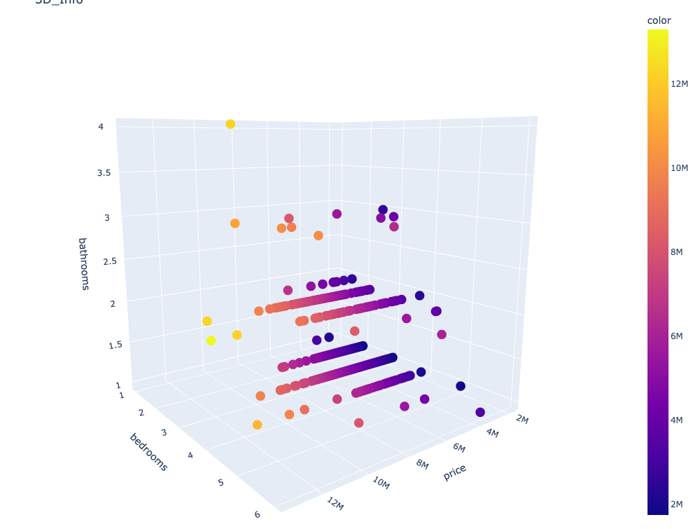
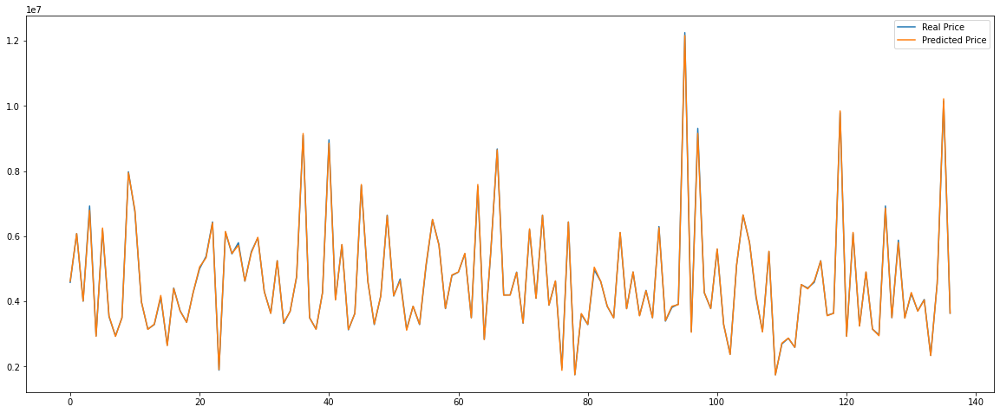

# Machine-Learning-xgboost-house-price-prediction
I have used xgboost for prediction of house price.
The dataset has been downloaded from the following link:
https://www.kaggle.com/datasets/yasserh/housing-prices-dataset?resource=download
I have shown the variatins between house price and bedrom numbers and restromm numbers in the following:

We can see very good fitting between our real price and predicted price:

